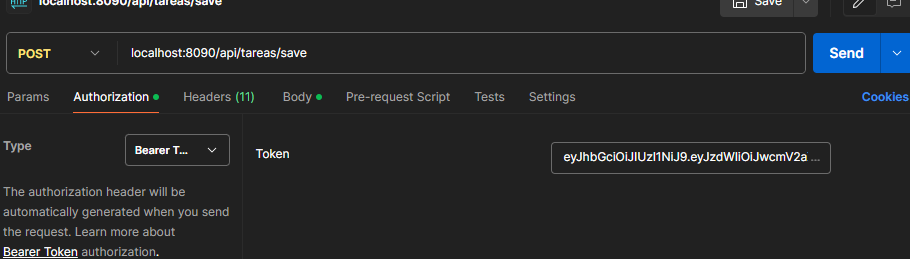

# JSON DE PRUEBA --POSTMAN

* Login
- Endpoint Metodo POST :  localhost:8085/authenticate/login
{
    "username": "previred",
    "password": "admin"
}

# Con el token obtenido ir a pestaña de autorizacion y seleccionar el tipo Bearer token. se adunta imagen 

* Crear tarea y asignar a un usuario.

- Endpoint Metodo POST : localhost:8085/saveTask

{
    "descripcion": "Primera tarea de prueba",
    "estadoTarea": {
        "id": 2,
        "descripcion": "ASIGNADA"
    },
    "usuario": {
        "id": 1,
        "username": "luciano",
        "email": "luciano.pantillon.alc@gmail.com",
        "password": "$2a$10$grht1iEFzAgPG87sWwG.7OfmRYKyThWizvAbSX0hy033d4KPMRXjm",
        "role": "USER"
    }
}

{
    "descripcion": "Segunda tarea de prueba",
    "estadoTarea": {
        "id": 2,
        "descripcion": "ASIGNADA"
    },
    "usuario": {
        "id": 2,
        "username": "leonardo",
        "email": "leo@gmail.com",
        "password": "$2a$10$AIMTpuZ7sU4WFFUKQMdyCuvUWZ3LEjijhdABYOL8xGeY2gACStTo6",
        "role": "USER"
    }
}

# Con el token obtenido (Anteriormente) ir a pestaña de autorizacion y seleccionar el tipo Bearer token.

* Modificar tarea.

- Endpoint metodo POST : localhost:8085/updateTask/1

{
    "id": 2,
    "descripcion": "Modificacion tarea de prueba",
    "estadoTarea": {
        "id": 3,
        "descripcion": "EN_PROCESO"
        },
    "usuario": {
        "id": 1,
        "username": "luciano",
        "email": "luciano.pantillon.alc@gmail.com",
        "password": "$2a$10$grht1iEFzAgPG87sWwG.7OfmRYKyThWizvAbSX0hy033d4KPMRXjm",
        "role": "USER"
    }
}

# Con el token obtenido (Anteriormente) ir a pestaña de autorizacion y seleccionar el tipo Bearer token.

* Listar todas las tareas .
- Endpoint metodo GET : localhost:8085/findAllTasks

# Con el token obtenido (Anteriormente) ir a pestaña de autorizacion y seleccionar el tipo Bearer token.

* Eliminar una tarea por id .
- Endpoint metodo DELETE : localhost:8085/deleteTask/1