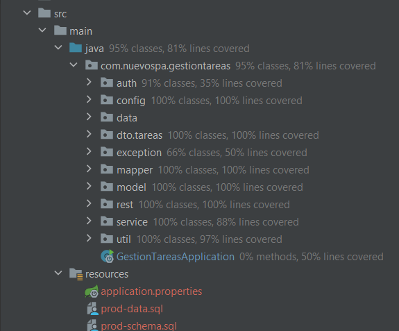
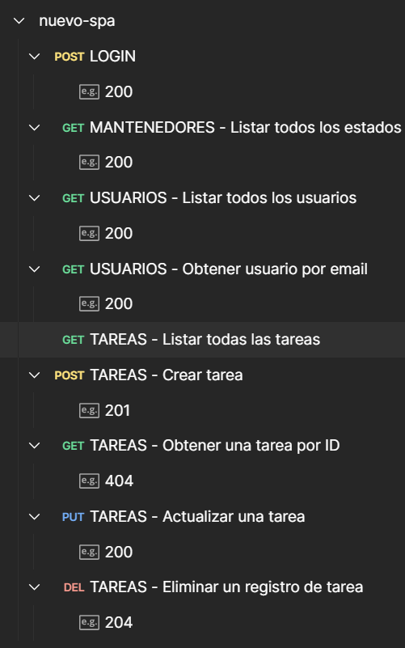

# Proyecto NUEVO SPA
Este proyecto consiste en un microservicio, escrito en lenguaje Java v17 y utiliza el framework Spring Boot v2.x.

La empresa NUEVO SPA desea desarrollar una plataforma de gestión de tareas para mejorar la productividad de sus equipos. El sistema debe permitir a los usuarios crear, actualizar, eliminar y listar tareas. Además, se requiere autenticación mediante JWT y documentación de la API utilizando OpenAPI y Swagger.

## Postuante

| Nombre | Marcelo Rojas H.          |
|---|---------------------------|
| Correo | marcelo.rojas@outlook.com |
| Cargo | Developer Backend         |


## Descripción Técnica del Proyecto
### Datos
La base de datos utilizada es H2. Esta base de datos se levanta junto con el proyecto y se destruye una vez terminada la ejecución del microservicio. Por lo tanto, los datos se pierden, ya que no está aconfigurada para persistir en disco.

La configuración de la base de datos está escrita en el archivo application.properties en /src/main/java/resources/application.properties.

El modelo de datos se encuentra en la ruta /src/main/java/resources/prod-schema.sql.

La base de datos se levanta con datos en la tabla ESTADOS_TAREAS y  USUARIOS. Estos datos están en el archivo /src/main/java/resources/prod-data.sql.

### Código del Microservicio
El código fuente se encuentra en el directorio /src/main/java, y se agrupa en packages, de acuerdo a su funcionalidad.

La jerarquía de los packages es la siguiente:



### Casos de Prueba
Los casos de prueba se encuentran en la ruta /src/main/test. En esta carpeta existe un directorio resoureces, en donde también se encuentra la configuración para testing de la base de datos H2.

Los casos de prueba están agrupados por package, y son correspondientes a las claes del código fuente al que cubren.

## Ejecución del Microservicio
### Prerequisitos
Es necesario contar con el siguiente software instalado:

| NOMBRE | OBS |
|---|---|
| Apache Maven | Para compilar y generar el ejecutable de Java |
| Java JDK 17 | Lenguaje Java |


### Variables de Entorno

Para ejecutar el microservicio se deben establecer las siguientes variables de entorno:

| NOMBRE | CONTENIDO | OBS                              |
|---|---|----------------------------------| 
| JWT_SEED | 1234567890 | Necesaria para encriptar los JWT |
| JWT_EXPIRATION_MS | 3660000 | Una hora                         | 

Para seteear estas variables en Windows:
```
set JWT_SEED=1234567890
set JWT_EXPIRATION_MS=3660000
```

Para seteear estas variables en Linux/Unix:
```
export JWT_SEED=1234567890
export JWT_EXPIRATION_MS=3660000
```

### Build del microservicio
Para compliar y generar el archivo ejecutable de Java, se debe ejecutar el siguiente comando
```
mvn clean package
```

### Ejecución
En la raíz del proyecto ejecutar:
En Unix/Linux
```
java -jar target/gestion-tareas-0.0.1.jar
```
En Windows
```
java -jar target\gestion-tareas-0.0.1.jar
```

### Pruebas con POSTMAN
En el directorio /docs/postman de este mismo proyecto se encuentra un archivo json en formato de exportación/iimportación de POSTMAN. Este archivo puede ser subido a cualquier instancia de POSTMAN apareciendo la siguiente colección de casos de prueba:



***Se debe ejecutar primero LOGIN, ya que esta opción carga un token como variable de ambiente postman, lo que permite poder trabajar con las demás opciones de la colección.***

Las opciones están todas con sus ejemplos de ejecución guardados con sus correspondientes códigos de resultados http.

En la opción de login se puede cambiar el usuario/password para conectarse con uno diferente, para ello se puede consultar el archivo /src/main/java/resources/prod-data.sql, que contiene la lista de las cuentas de usuario precargados en la base de datos H2.


